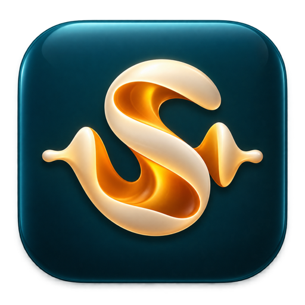

# Svara

### Keep the sound.

Record an application's audio. Shape it. Keep it on your Mac.

**macOS 26 or newer · Mac App Store release in development**

[Features](#a-focused-recorder-a-more-capable-pro) · [Privacy](PRIVACY.md) · [Support](SUPPORT.md)

Svara is a native Mac audio recorder built around a simple workflow: pick a running application, choose where to save, and record. No audio-routing drivers, microphone recording, or cloud workspace required.

This repository is the public product and support page. **Svara is not available to download yet.** The Mac App Store link will appear here after release. App source code is private, and this repository will not distribute app binaries.

## A focused recorder. A more capable Pro.

The following describes the current development build and planned launch tiers. Features are still undergoing testing and are not a released product.

| Svara Free | Svara Pro |
|---|---|
| Record audio from one application | Everything in Free |
| AAC recordings with no artificial duration limit | Lossless ALAC and uncompressed WAV |
| Choose a destination and open saved files | Trim, preview, and export copies, including MP3 up to 320 kbps |
| Menu-bar recording controls | Timed recording and optional silence-based stopping |
| Visible status and audio level | Reusable recording presets |
| Local audio processing | Searchable recording library and editable titles |

Pro is planned as a **one-time in-app purchase**, with no subscription. Final pricing will be confirmed in the Mac App Store. Free recording will not have ads, watermarks, or an arbitrary recording cutoff.

## Built for the sounds you are allowed to keep

Record your own app demonstrations, sound-design experiments, instrument software, or other audio you have permission to capture. The app records at the application level: selecting a browser can include every audible tab in that browser.

Svara saves audio only. It does not save screen video, capture the microphone, unlock protected media, or grant rights to recorded content. A lossless recording preserves the captured audio without another lossy encoding step; it cannot restore detail absent from the source.

## Release status

- Native recording and Pro tools are in development and validation.
- Apple purchase/restore testing and beta acceptance are required before launch.
- No public app download, TestFlight invitation, or App Store release is available yet.
- macOS 26 is the minimum planned operating system.

## Support and feedback

Read the [support guide](SUPPORT.md), then [open an issue](https://github.com/pstarwars2026/svara/issues/new/choose). Please use generic examples and do not attach private recordings or personal information.

Copyright © 2026 pstarwars2026. Svara is proprietary software; this product page does not grant access or a license to its app source code.
