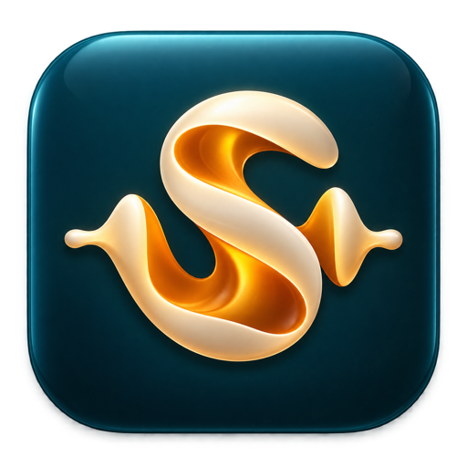

# Svara

### Keep the sound.

Record an application's audio. Shape it. Keep it on your Mac.

**macOS 26 or newer · Available on the Mac App Store**

[Download on the Mac App Store](https://apps.apple.com/us/app/svara-audio-recorder/id6813962461?mt=12)

[Features](#a-focused-recorder-a-more-capable-pro) · [Privacy](PRIVACY.md) · [Support](SUPPORT.md)

Svara is a native Mac audio recorder built around a simple workflow: pick a running application, choose where to save, and record. No audio-routing drivers, microphone recording, or cloud workspace required.

Svara is available on the [Mac App Store](https://apps.apple.com/us/app/svara-audio-recorder/id6813962461?mt=12). This repository is the public product and support page. App source code is private, and this repository will not distribute app binaries.

## A focused recorder. A more capable Pro.

These features are included in version 1.0, available now on the Mac App Store.

| Svara Free | Svara Pro |
|---|---|
| Record audio from one application | Everything in Free, with unlimited recording |
| AAC recordings: 10 minutes total per day | Lossless ALAC and uncompressed WAV |
| Choose a destination and open saved files | Trim, preview, and export copies, including MP3 up to 320 kbps |
| Menu-bar recording controls | Timed recording and optional silence-based stopping |
| Visible status and audio level | Reusable recording presets |
| Local audio processing | Searchable recording library and editable titles |

Svara is free to download. Pro is a **US $2.99 one-time in-app purchase**, with no subscription. Prices in other countries are localized by Apple. Free includes 10 minutes of recording per day across sessions on this Mac. The remaining time and daily reset are shown in the app; recording automatically stops and saves at the limit or reset. Pro has no artificial daily or per-recording limit. Neither tier adds ads or watermarks.

## Built for the sounds you are allowed to keep

Record your own app demonstrations, sound-design experiments, instrument software, or other audio you have permission to capture. The app records at the application level: selecting a browser can include every audible tab in that browser.

Svara saves audio only. It does not save screen video, capture the microphone, unlock protected media, or grant rights to recorded content. A lossless recording preserves the captured audio without another lossy encoding step; it cannot restore detail absent from the source.

## Release status

- Version 1.0 and Svara Pro were released on the Mac App Store on September 29, 2026. [Download Svara](https://apps.apple.com/us/app/svara-audio-recorder/id6813962461?mt=12).
- Recording permission uses the native macOS flow: Refresh Apps invokes macOS authorization, with no direct Settings redirect.
- Requires macOS 26 or later.

## Support and feedback

Read the [support guide](SUPPORT.md), then [open an issue](https://github.com/pstarwars2026/svara/issues/new/choose). Please use generic examples and do not attach private recordings or personal information.

Copyright © 2026 pstarwars2026. Svara is proprietary software; this product page does not grant access or a license to its app source code.
